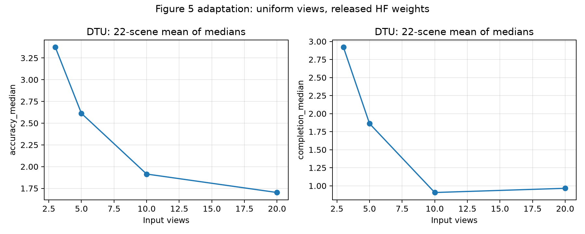

# Fast3R 论文复现与评测审计

> **项目定位：公开预训练权重下的部分复现。** 复现了推理与多数据集重建评测流程，并对照论文核验结果；Table 1 位姿评测、训练型消融和若干附录实验尚未完成。本项目不宣称完整复现，也不宣称达到论文指标。
>
> **Project status:** Partial reproduction using public pretrained weights. The evaluation pipeline and several reconstruction benchmarks were run and audited. Pose evaluation, training-based ablations, and several appendix experiments remain incomplete.

[论文（CVPR 2025）](https://arxiv.org/abs/2501.13928) · [官方代码库](https://github.com/facebookresearch/fast3r) · [项目页](https://fast3r-3d.github.io/) · [公开模型权重](https://huggingface.co/jedyang97/Fast3R_ViT_Large_512)

## 项目简介

本项目围绕 Fast3R 论文的复现边界开展工作：固定公开代码、配置和权重身份，准备规定测试数据，运行逐场景评测，再按论文统计口径重算聚合指标。报告保留了与论文不一致的结果和未验证的协议差异，便于后续定位原因。

主要工作包括：

- 验证多视图推理链路，并对归一化点图损失做数值与梯度检查。
- 完成 DTU 22 个场景、Neural RGB-D 9 个场景、7-Scenes 18 条测试轨迹的公开权重评测。
- 复核数据清单、场景覆盖、帧号、相机/GT、图像解码、随机种子、权重/配置指纹和逐场景指标。
- 通过同一次前向比较 aligned-local 与 global 点图；在 DTU 三个场景上做固定预测阈值敏感性诊断。
- 重新聚合 Table 3–5 的结果，并如实报告与论文数值和趋势的差距。

## 主要重建结果

距离指标越低越好。Table 3 数值按论文表格口径乘 100；DTU Table 4 保留原距离单位。

| 表格 / 数据集 | 覆盖 | Accuracy median：本地 / 论文 | Completion median：本地 / 论文 | 相对差距：Accuracy / Completion |
| --- | ---: | ---: | ---: | ---: |
| Table 3 / Neural RGB-D | 9 场景 | 4.0165 / 3.40 | 1.2001 / 1.01 | +18.13% / +18.82% |
| Table 3 / 7-Scenes | 18 条轨迹 | 3.3035 / 1.58 | 3.1058 / 0.93 | +109.08% / +233.95% |
| Table 4 / DTU | 22 场景 | 2.0827 / 1.706 | 1.0311 / 0.857 | +22.08% / +20.31% |

这些数据集的规定测试集合已运行，但结果并未匹配论文。公开 checkpoint 与论文各表训练权重的对应关系、部分采样和预处理细节仍未完全确认，因此不把差距归因于单一因素。

基线设置分别为 DTU `seed=42/stride=5`、Neural RGB-D `seed=42/stride=40`、7-Scenes `seed=42/stride=20`。本地评测使用 NVIDIA GeForce RTX 5070 Ti Laptop GPU、PyTorch 2.7.1+cu128、512 分辨率和 16-bit mixed precision；这些是本次运行环境，不代表跨硬件逐 bit 复现。相对差距按未舍入的本地聚合值和论文表中报告值计算，表内指标再行舍入。输入标签、精度和 head 分块等细节保存在逐场景报告中。

## Table 5：同次前向 local/global 配对

下表为 mean distance ×100，格式为 Accuracy / Completion。

| 数据集 | 本地 aligned-local | 本地 global | 论文 aligned-local | 论文 global |
| --- | ---: | ---: | ---: | ---: |
| Neural RGB-D | 9.7108 / 3.1292 | 9.2594 / 3.1789 | 4.39 / 1.28 | 4.85 / 1.32 |
| 7-Scenes | 6.3613 / 7.0516 | 6.9567 / 6.3510 | 2.84 / 1.37 | 4.81 / 1.64 |
| DTU | 4.1451 / 2.3889 | 4.3514 / 2.7941 | 3.91 / 1.41 | 3.88 / 1.41 |

同一次前向控制了模型输出的随机差异；本地结果仍未在所有数据集上复现论文中 local 相对 global 的优势方向。

## 视角数与阈值诊断

DTU 3/5/10/20 视角实验完成 88 次评测前向，使用本地均匀采样。论文采用的关键帧采样不同，所以这是 Figure 5 的本地适配对照，不是原协议的精确复现。



另在 `scan1`、`scan10`、`scan11` 各运行一次前向，复用同一预测比较 7 组阈值。以下数值为未乘 100 的原始 DTU 距离单位：三场景 baseline 85/0 的 mean Accuracy/Completion 为 **6.9304 / 2.4108**；`metric75` 为 **3.4452 / 13.1753**。筛点后 Accuracy 距离下降，但 Completion 明显恶化。`alignment percentile` 同时影响 local-to-global 对齐筛点和 GT 配准权重，因此这不是单一因素消融，也不构成阈值推荐。

## 复现流程

1. 按论文表格和图拆出待验证主张，明确指标、划分、采样、模型权重和硬件要求。
2. 核验代码、配置和 checkpoint 来源，保存版本、SHA256、seed、软件环境和输入视图标签。
3. 按官方测试划分准备数据；用 manifest、CRC/SHA、图像解码和 GT/相机检查确认覆盖，不静默删除缺失场景。
4. 运行模型并保存逐场景指标；按论文指定的 mean/median、单位、缩放和聚合顺序重算结果。
5. 对消融使用可比输入；local/global 复用同次前向，阈值诊断固定预测并核对预测 SHA。
6. 将结果与论文逐项比较，分别记录“代码核对”“数据就绪”“本地运行”“协议等价”和“结果匹配”。

完整命令、数据准备记录和逐项解释见[论文复现记录](PAPER_REPRODUCTION.md)；Notebook 保存分析输出和对照表。

## 尚未完成的论文部分

- **Table 1 / Figure 4 位姿评测：** RE10K 规定 1,832 个场景中已准备 1,756 个，缺 76 个；因此没有完整正式 RRA/RTA/mAA。已完成的 205 GB 来源扫描未找回这些场景。一个公开 429 GB 候选镜像尚未核实对这 76 个 ID 的覆盖，未下载数据。
- **CO3D：** 正式评测未完成；历史 100 请求结果属于候选协议适配，不是论文 Table 1 成绩。当前复现范围不包含 CO3D 数据。
- **训练型消融：** Figures 6–7 的训练视角对照、§5.2/附录 A–B 的模型规模和训练数据量对照，需要独立训练权重；Figure 8 目前只有位置插值机制核对，没有独立训练消融。
- **完整训练：** 论文报告 128 张 A100-80GB、174K steps 的训练设置，本项目未执行。
- **附录 C–E：** Gaussian Splatting、GS-BA 和 RMVD/Table 7 缺少规定数据或依赖，论文实验未运行。已有点云展示只覆盖部分可视化。
- **硬件与协议：** 本地性能测试不是论文 A100 多卡、1000–1500 视角设置；Figure 5 使用的视角采样也不同于论文设置。

完整状态和停止边界见[结项交接](REPRODUCTION_HANDOFF.md)。数据集与模型权重不随本仓库分发；按官方许可和来源说明自行获取。

## 简历项目表述

**中文：**

> 基于 Fast3R 官方代码与公开权重开展部分复现，完成 DTU 22 场景、Neural RGB-D 9 场景及 7-Scenes 18 条测试轨迹评测；搭建数据清单/哈希核验和逐场景指标复核流程，完成 local/global 同次前向对照及 DTU 三场景阈值敏感性分析，并量化本地结果与论文指标的差距。

**English:**

> Conducted a partial reproduction of Fast3R using its official codebase and public checkpoint. Evaluated 22 DTU scenes, 9 Neural RGB-D scenes, and all 18 7-Scenes test trajectories; built data provenance and per-scene metric checks, ran same-forward local/global comparisons and a three-scene DTU threshold sensitivity study, and quantified deviations from the paper.

不要写“完整复现论文”或“达到论文指标”。面试时可以说明 Table 1、训练消融及附录实验尚未完成，并解释对应的数据与算力边界。

## 复现记录与产物

- [逐项论文对应表与详细结果](PAPER_REPRODUCTION.md)
- [复现流程、科研方法与简历建议](REPRODUCTION_HANDOFF.md)
- [Notebook：分析表格与保存输出](fast3r_reproduction.ipynb)
- [公开权重和协议审计](PROTOCOL_AUDIT.md)
- [DTU 22 场景结果](results/dtu_seed42_stride5.json)
- [Neural RGB-D 9 场景结果](results/nrgbd_seed42_stride40.json)
- [7-Scenes 配对结果](results/7scenes_paired_seed42_stride20.json)
- [DTU 三场景阈值报告目录](results/diagnostics/)
- [RE10K 来源补充审计](results/re10k_missing_source_followup_20261003.json)

安装与原始 demo 用法请参考[Fast3R 官方仓库 README](https://github.com/facebookresearch/fast3r#readme)。本 fork 的重点是公开权重评测、协议核验和复现差距分析。

## 引用

```bibtex
@InProceedings{Yang_2025_Fast3R,
  title={Fast3R: Towards 3D Reconstruction of 1000+ Images in One Forward Pass},
  author={Jianing Yang and Alexander Sax and Kevin J. Liang and Mikael Henaff and Hao Tang and Ang Cao and Joyce Chai and Franziska Meier and Matt Feiszli},
  booktitle={Proceedings of the IEEE/CVF Conference on Computer Vision and Pattern Recognition (CVPR)},
  month={June},
  year={2025}
}
```

原始 Fast3R 实现版权和许可见仓库 [`LICENSE`](LICENSE)。本项目复现报告与结果用于研究记录；引用原论文及上游代码时请同时注明来源。
